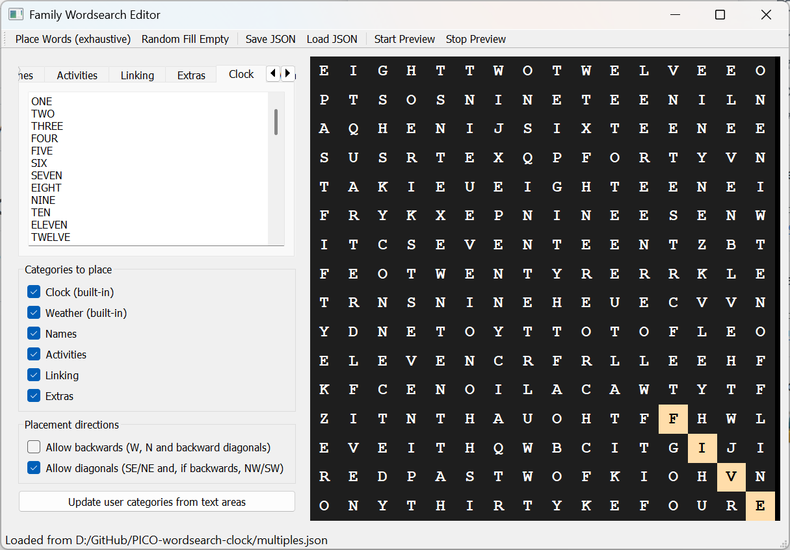

# Custom Wordsearch Design



If you want to create your own wordsearch design you can use the Python **WordsearchEditor** program. Installers are provided for Raspberry Pi, Windows and Mac systems.

The program will build a wordsearch containing different sets of words. You can add to the sets of words although the present version of clock does not use them. The prorogram will make multiple attempts to create the wordsearch before giving up. If it repeatedly fails you will have to reduce the number of words you are using. You can load the existing wordsearch design (in the file **clockface.json**) as a starting point.

You put your custom wordsearch file in the firmware folder, replacing the existing **clockface.json** file. 

The customer wordsearch design file is used by the FreeCAD design program to create the STL files for printing your custom clock. Load the **Builder.py** program into the [FreeCAD](https://www.freecad.org/index.php?lang=en) design tool. Direct the program to your json clock file by editing this line at the top of program:

```Python
json_path = r"D:\GitHub\PICO-wordsearch-clock\firmware-PICO\clockface.json"
```

Now you can run the program to create the case files for your custom wordsearch. You select the format you want by un-commenting one of the statements which are at the bottom of the **Builder.py** source file. 

```Python
# design for through hole letters
#make_grid(grid=rows,engrave_letters=True,no_letters_on_tiles=False,letter_cell_base_thickness_mm=2.0,letter_thickness_mm=2.0,behind_letter_panel_thickness=0.5)

# design for obscured letters
#make_grid(grid=rows,engrave_letters=True,no_letters_on_tiles=False)

# Test design for making quick boxes to check layout
make_grid(grid=rows,engrave_letters=True,no_letters_on_tiles=True,letter_cell_base_thickness_mm=2.0,letter_thickness_mm=2.0,behind_letter_panel_thickness=0.5,speaker=True)
```
[Resources Home](../README.md)