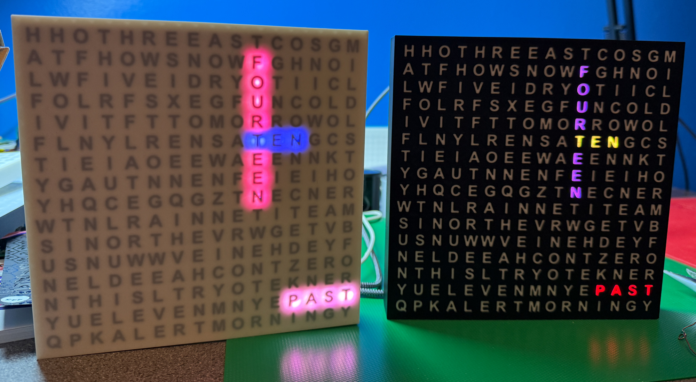

# Case Build Files

This folder contains all the build files for the clock. You can print them in standard PLA 

## Front Panel Design

The front of the clock is made from two elements which are printed as one, using a printer which supports multiple filaments. The panel element contains voids that are filled with the letters. One of the two elements should be transparent so that lights behind the letters can shine through.

There are two versions of the front panel and letters. One has a smooth front surface with the letters slightly behind it.  The other has letters which are printed all the way through the front panel. You can see the two different designs above. Pick the front design that you prefer from the folder **Obscured Letters** or the folder **Through Letters**. If you use the one with a smooth front surface be careful not to use a strong colour for it as the letters might not be visible.

When you slice the front panel design you need to drag both **frontLetters** and **frontPanel** into the slicer and then say yes to the dialogue that appears. 

You can now use the slicer menu to select different colours for the two objects. If you use the **Through Letters** design you should slow the printer down for the first few layers of the print. This is to make sure that the individual letters (which are usually printed first) adhere to the bed.

## Case Parts

The other parts of the clock are common to both designs. The **separator** fits between the front of the clock and the flexible LED panel and reduces the light bleed from one letter to another. This should be printed using an opaque colour, preferably black.

The are two back files, one contains fittings for the alarm control buttons, DFPlayer device and speaker. The other is for use with the standard clock configuration. None of the files needs support when printed. The front and the back of the clock snap together. 

[Resources Home](../README.md)